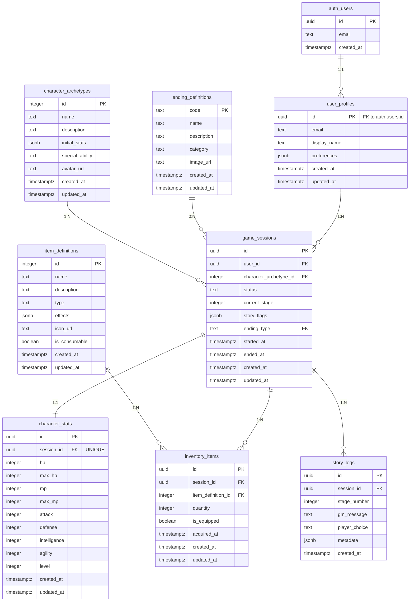

# ERD 설계 문서 (Entity Relationship Diagram)
## Shadow Lord Slayer TRPG 게임

---

## 문서 정보

| 항목 | 내용 |
|------|------|
| **문서 제목** | Shadow Lord Slayer TRPG - ERD 설계 문서 |
| **서비스명 (한글)** | 볼드모트 죽이기 TRPG |
| **서비스명 (영문)** | Shadow Lord Slayer TRPG |
| **데이터베이스** | PostgreSQL (Supabase) |
| **작성일** | 2026년 1월 29일 |
| **대상 독자** | 백엔드 개발자, 데이터베이스 관리자 |
| **문서 버전** | v1.0 |

---

## 목차

1. [비즈니스 도메인 정의](#1-비즈니스-도메인-정의)
2. [핵심 엔티티 개요](#2-핵심-엔티티-개요)
3. [비즈니스 규칙](#3-비즈니스-규칙)
4. [ERD 다이어그램](#4-erd-다이어그램)
5. [엔티티 상세 명세](#5-엔티티-상세-명세)
6. [관계 정의](#6-관계-정의)
7. [인덱스 전략](#7-인덱스-전략)
8. [정규화 분석](#8-정규화-분석)
9. [성능 최적화 고려사항](#9-성능-최적화-고려사항)
10. [마이그레이션 및 버저닝 전략](#10-마이그레이션-및-버저닝-전략)

---

## 1. 비즈니스 도메인 정의

### 1.1 도메인 개요

**Shadow Lord Slayer TRPG**는 AI 게임 마스터(GM)가 진행하는 단일 플레이어 텍스트 기반 롤플레잉 게임입니다. 사용자는 마법 학교 세계관의 캐릭터를 선택하여 약 10분 내외의 짧은 세션을 플레이하며, 스토리 선택을 통해 최종 보스를 물리치거나 실패하는 엔딩에 도달합니다.

### 1.2 핵심 비즈니스 개념

| 개념 | 설명 |
|------|------|
| **사용자 (User)** | 게임을 플레이하는 플레이어, Supabase Auth와 연동 |
| **게임 세션 (Game Session)** | 게임 시작부터 엔딩까지의 한 회차 플레이 |
| **캐릭터 (Character)** | 세션 내에서 플레이어가 선택한 캐릭터 아키타입 |
| **스테이지 (Stage)** | 스토리 진행 단위 (총 7개 스테이지로 구성) |
| **선택 (Choice)** | 각 스테이지에서 플레이어가 내리는 결정 |
| **인벤토리 (Inventory)** | 세션별로 보유한 아이템 목록 |
| **엔딩 (Ending)** | 게임 완료 시 도달한 결말 유형 |

### 1.3 데이터 범위

- **시간 범위**: 한 세션당 약 10분, 사용자당 무제한 세션 가능
- **사용자 규모**: 초기 10~100명, 향후 1,000명 이상 확장 가능
- **데이터 보존**: 모든 세션 기록 영구 보존 (분석 및 재플레이 지원)
- **실시간 요구사항**: AI 응답 생성 시 현재 게임 상태 조회 (3초 이내)

---

## 2. 핵심 엔티티 개요

### 2.1 엔티티 목록

| 엔티티명 (한글) | 엔티티명 (영문) | 설명 | 우선순위 |
|----------------|----------------|------|----------|
| 사용자 프로필 | `user_profiles` | 애플리케이션 레벨 사용자 정보 | P0 |
| 캐릭터 아키타입 | `character_archetypes` | 선택 가능한 캐릭터 템플릿 (마스터 데이터) | P0 |
| 게임 세션 | `game_sessions` | 한 회차의 게임 진행 정보 | P0 |
| 캐릭터 스탯 | `character_stats` | 세션별 캐릭터의 현재 스탯 | P0 |
| 인벤토리 아이템 | `inventory_items` | 세션별 보유 아이템 목록 | P0 |
| 스토리 로그 | `story_logs` | 각 스테이지의 GM 메시지 및 플레이어 선택 기록 | P1 |
| 아이템 정의 | `item_definitions` | 게임에서 사용 가능한 아이템 마스터 데이터 | P1 |
| 엔딩 정의 | `ending_definitions` | 가능한 엔딩 타입 및 설명 (마스터 데이터) | P2 |

### 2.2 엔티티 분류

**트랜잭션 데이터**:
- `game_sessions`: 게임 플레이 세션
- `character_stats`: 세션별 캐릭터 상태
- `inventory_items`: 세션별 아이템 보유
- `story_logs`: 플레이 기록

**마스터 데이터**:
- `character_archetypes`: 캐릭터 템플릿
- `item_definitions`: 아이템 템플릿
- `ending_definitions`: 엔딩 정보

**사용자 데이터**:
- `user_profiles`: 사용자 프로필

---

## 3. 비즈니스 규칙

### 3.1 사용자 및 인증

1. **BR-001**: 모든 사용자는 Supabase Auth를 통해 인증되어야 함
2. **BR-002**: `user_profiles.id`는 Supabase Auth의 `auth.users.id`와 동일한 UUID를 사용
3. **BR-003**: 한 사용자는 여러 게임 세션을 가질 수 있음 (1:N)
4. **BR-004**: 사용자는 자신의 데이터만 조회/수정 가능 (RLS로 강제)

### 3.2 게임 세션

5. **BR-005**: 한 게임 세션은 하나의 캐릭터 아키타입을 선택하여 시작
6. **BR-006**: 세션 상태는 `in_progress`, `completed_success`, `completed_failure`, `abandoned` 중 하나
7. **BR-007**: 세션이 완료되면 `ended_at` 타임스탬프가 기록됨
8. **BR-008**: 한 사용자는 동시에 하나의 `in_progress` 세션만 가질 수 있음 (비즈니스 로직으로 강제)
9. **BR-009**: 세션은 총 7개 스테이지로 구성되며, `current_stage`는 1~7 범위

### 3.3 캐릭터 및 스탯

10. **BR-010**: 캐릭터 스탯은 세션별로 독립적임 (세션 간 공유 안 됨)
11. **BR-011**: 초기 스탯은 선택한 `character_archetype`의 `initial_stats` 값으로 설정
12. **BR-012**: HP가 0 이하가 되면 세션은 자동으로 `completed_failure` 상태로 전환
13. **BR-013**: 스탯은 플레이어의 선택에 따라 동적으로 변경됨

### 3.4 인벤토리

14. **BR-014**: 인벤토리는 세션별로 최대 10개 아이템 보유 가능
15. **BR-015**: 아이템은 `item_definitions` 테이블에 정의된 템플릿을 참조
16. **BR-016**: 소모성 아이템은 `quantity` 필드로 수량 관리

### 3.5 스토리 진행

17. **BR-017**: 각 스테이지마다 최소 1개의 `story_log` 레코드가 생성됨
18. **BR-018**: `story_flags` (JSONB)는 중요한 선택이나 이벤트를 기록 (예: `{"saved_friend": true, "used_spell_x": false}`)
19. **BR-019**: 최종 스테이지 완료 시 `ending_type`이 결정됨
20. **BR-020**: 세션 완료 후에도 로그는 삭제되지 않고 보존됨 (분석용)

### 3.6 데이터 무결성

21. **BR-021**: 외래키는 `ON DELETE CASCADE` 또는 `ON DELETE RESTRICT`로 설정
    - `game_sessions.user_id`: `ON DELETE CASCADE` (사용자 삭제 시 세션도 삭제)
    - `character_stats.session_id`: `ON DELETE CASCADE`
    - `inventory_items.session_id`: `ON DELETE CASCADE`
    - `story_logs.session_id`: `ON DELETE CASCADE`
22. **BR-022**: 모든 테이블은 `created_at`, `updated_at` 컬럼을 포함

---

## 4. ERD 다이어그램

### 4.1 전체 ERD (Mermaid)



### 4.2 ERD 관계 요약

| 관계 | 카디널리티 | 설명 |
|------|-----------|------|
| `auth.users` ↔ `user_profiles` | 1:1 | Supabase Auth 사용자와 애플리케이션 프로필 |
| `user_profiles` ↔ `game_sessions` | 1:N | 한 사용자는 여러 세션 보유 |
| `character_archetypes` ↔ `game_sessions` | 1:N | 한 아키타입은 여러 세션에서 사용 |
| `game_sessions` ↔ `character_stats` | 1:1 | 한 세션은 하나의 캐릭터 스탯 |
| `game_sessions` ↔ `inventory_items` | 1:N | 한 세션은 여러 아이템 보유 |
| `game_sessions` ↔ `story_logs` | 1:N | 한 세션은 여러 로그 기록 |
| `item_definitions` ↔ `inventory_items` | 1:N | 한 아이템 정의는 여러 인벤토리에서 사용 |
| `ending_definitions` ↔ `game_sessions` | 0:N | 한 엔딩은 여러 세션에서 도달 가능 |

---

## 5. 엔티티 상세 명세

### 5.1 user_profiles (사용자 프로필)

**목적**: 애플리케이션 레벨의 사용자 정보 저장

| 컬럼명 | 데이터 타입 | Null 허용 | 기본값 | 설명 |
|--------|------------|----------|--------|------|
| `id` | `uuid` | NO | - | **PK**, Supabase Auth의 `auth.users.id`와 동일 |
| `email` | `text` | NO | - | 사용자 이메일 (auth에서 동기화) |
| `display_name` | `text` | YES | NULL | 사용자 표시 이름 (선택적) |
| `preferences` | `jsonb` | YES | `'{}'::jsonb` | 사용자 환경 설정 (예: `{"text_size": "medium", "theme": "dark"}`) |
| `created_at` | `timestamptz` | NO | `now()` | 계정 생성 일시 |
| `updated_at` | `timestamptz` | NO | `now()` | 마지막 업데이트 일시 |

**제약조건**:
- **PRIMARY KEY**: `id`
- **FOREIGN KEY**: `id` REFERENCES `auth.users(id)` ON DELETE CASCADE
- **UNIQUE**: `email`

**인덱스**:
- `PRIMARY KEY` 인덱스: `id`
- `UNIQUE` 인덱스: `email`

**Note**: 
- Supabase Auth 트리거를 사용하여 새 사용자 생성 시 자동으로 `user_profiles` 레코드 생성 가능
- RLS 정책: 사용자는 본인의 프로필만 읽기/쓰기 가능

---

### 5.2 character_archetypes (캐릭터 아키타입)

**목적**: 선택 가능한 캐릭터 템플릿 정의 (마스터 데이터)

| 컬럼명 | 데이터 타입 | Null 허용 | 기본값 | 설명 |
|--------|------------|----------|--------|------|
| `id` | `serial` | NO | auto | **PK**, 아키타입 고유 ID |
| `name` | `text` | NO | - | 캐릭터 이름 (예: "용감한 전사", "영리한 학자") |
| `description` | `text` | NO | - | 캐릭터 설명 (100~200자) |
| `initial_stats` | `jsonb` | NO | - | 초기 스탯 JSON (예: `{"hp": 100, "mp": 50, "attack": 15, ...}`) |
| `special_ability` | `text` | YES | NULL | 특수 능력 설명 |
| `avatar_url` | `text` | YES | NULL | 캐릭터 아바타 이미지 URL |
| `created_at` | `timestamptz` | NO | `now()` | 생성 일시 |
| `updated_at` | `timestamptz` | NO | `now()` | 업데이트 일시 |

**제약조건**:
- **PRIMARY KEY**: `id`
- **UNIQUE**: `name`

**인덱스**:
- `PRIMARY KEY` 인덱스: `id`

**초기 데이터 예시**:
```sql
INSERT INTO character_archetypes (name, description, initial_stats, special_ability) VALUES
('용감한 전사', '뛰어난 전투 능력을 가진 캐릭터', '{"hp": 110, "mp": 40, "attack": 17, "defense": 13, "intelligence": 8, "agility": 10}', '공격력 +2 보너스'),
('영리한 학자', '높은 지능과 마법 능력', '{"hp": 80, "mp": 100, "attack": 10, "defense": 8, "intelligence": 18, "agility": 12}', '마법 성공률 +15%'),
('교활한 책략가', '민첩성과 회피에 특화', '{"hp": 90, "mp": 60, "attack": 13, "defense": 10, "intelligence": 12, "agility": 16}', '회피율 +10%'),
('자비로운 치유사', '회복 능력과 지원에 특화', '{"hp": 95, "mp": 80, "attack": 8, "defense": 12, "intelligence": 15, "agility": 9}', '회복량 +20%');
```

**Note**: 
- 마스터 데이터이므로 일반 사용자는 읽기만 가능 (RLS)
- 관리자만 수정 가능

---

### 5.3 game_sessions (게임 세션)

**목적**: 한 회차의 게임 플레이 정보 저장

| 컬럼명 | 데이터 타입 | Null 허용 | 기본값 | 설명 |
|--------|------------|----------|--------|------|
| `id` | `uuid` | NO | `gen_random_uuid()` | **PK**, 세션 고유 ID |
| `user_id` | `uuid` | NO | - | **FK** to `user_profiles.id` |
| `character_archetype_id` | `integer` | NO | - | **FK** to `character_archetypes.id` |
| `status` | `text` | NO | `'in_progress'` | 세션 상태: `in_progress`, `completed_success`, `completed_failure`, `abandoned` |
| `current_stage` | `integer` | NO | `1` | 현재 스테이지 번호 (1~7) |
| `story_flags` | `jsonb` | YES | `'{}'::jsonb` | 스토리 진행 플래그 (예: `{"saved_ally": true, "found_key": false}`) |
| `ending_type` | `text` | YES | NULL | **FK** to `ending_definitions.code`, 도달한 엔딩 코드 |
| `started_at` | `timestamptz` | NO | `now()` | 세션 시작 일시 |
| `ended_at` | `timestamptz` | YES | NULL | 세션 종료 일시 (완료 시 설정) |
| `created_at` | `timestamptz` | NO | `now()` | 레코드 생성 일시 |
| `updated_at` | `timestamptz` | NO | `now()` | 레코드 업데이트 일시 |

**제약조건**:
- **PRIMARY KEY**: `id`
- **FOREIGN KEY**: 
  - `user_id` REFERENCES `user_profiles(id)` ON DELETE CASCADE
  - `character_archetype_id` REFERENCES `character_archetypes(id)` ON DELETE RESTRICT
  - `ending_type` REFERENCES `ending_definitions(code)` ON DELETE SET NULL
- **CHECK**: `status IN ('in_progress', 'completed_success', 'completed_failure', 'abandoned')`
- **CHECK**: `current_stage >= 1 AND current_stage <= 7`
- **CHECK**: `ended_at IS NULL OR ended_at >= started_at`

**인덱스**:
- `PRIMARY KEY` 인덱스: `id`
- `INDEX`: `user_id` (사용자별 세션 조회)
- `INDEX`: `(user_id, status)` (진행 중인 세션 조회 최적화)
- `INDEX`: `created_at DESC` (최신 세션 조회)
- `INDEX`: `ending_type` (엔딩별 통계)

**Note**: 
- `status`가 `in_progress`일 때만 `ended_at`은 NULL
- 세션 완료 시 `ended_at` 타임스탬프와 `ending_type` 설정
- RLS: 사용자는 본인의 세션만 조회/수정 가능

---

### 5.4 character_stats (캐릭터 스탯)

**목적**: 세션별 캐릭터의 현재 스탯 저장

| 컬럼명 | 데이터 타입 | Null 허용 | 기본값 | 설명 |
|--------|------------|----------|--------|------|
| `id` | `uuid` | NO | `gen_random_uuid()` | **PK**, 스탯 레코드 고유 ID |
| `session_id` | `uuid` | NO | - | **FK** to `game_sessions.id`, **UNIQUE** |
| `hp` | `integer` | NO | - | 현재 체력 |
| `max_hp` | `integer` | NO | - | 최대 체력 |
| `mp` | `integer` | NO | - | 현재 마나 |
| `max_mp` | `integer` | NO | - | 최대 마나 |
| `attack` | `integer` | NO | - | 공격력 |
| `defense` | `integer` | NO | - | 방어력 |
| `intelligence` | `integer` | NO | - | 지능 |
| `agility` | `integer` | NO | - | 민첩성 |
| `level` | `integer` | NO | `1` | 레벨 (현재 버전에서는 사용 안 할 수도 있음) |
| `created_at` | `timestamptz` | NO | `now()` | 생성 일시 |
| `updated_at` | `timestamptz` | NO | `now()` | 업데이트 일시 |

**제약조건**:
- **PRIMARY KEY**: `id`
- **FOREIGN KEY**: `session_id` REFERENCES `game_sessions(id)` ON DELETE CASCADE
- **UNIQUE**: `session_id` (한 세션은 하나의 스탯만 가짐)
- **CHECK**: `hp >= 0 AND hp <= max_hp`
- **CHECK**: `mp >= 0 AND mp <= max_mp`
- **CHECK**: `max_hp > 0 AND max_mp > 0`
- **CHECK**: `attack >= 0 AND defense >= 0 AND intelligence >= 0 AND agility >= 0`

**인덱스**:
- `PRIMARY KEY` 인덱스: `id`
- `UNIQUE` 인덱스: `session_id`

**Note**: 
- 세션 생성 시 `character_archetypes.initial_stats`를 기반으로 초기화
- 게임 진행 중 선택에 따라 동적으로 업데이트
- `hp`가 0이 되면 세션 상태를 `completed_failure`로 변경하는 로직 필요

---

### 5.5 inventory_items (인벤토리 아이템)

**목적**: 세션별 보유 아이템 목록 저장

| 컬럼명 | 데이터 타입 | Null 허용 | 기본값 | 설명 |
|--------|------------|----------|--------|------|
| `id` | `uuid` | NO | `gen_random_uuid()` | **PK**, 인벤토리 항목 고유 ID |
| `session_id` | `uuid` | NO | - | **FK** to `game_sessions.id` |
| `item_definition_id` | `integer` | NO | - | **FK** to `item_definitions.id` |
| `quantity` | `integer` | NO | `1` | 아이템 수량 (소모품용) |
| `is_equipped` | `boolean` | NO | `false` | 장착 여부 (장비 아이템용) |
| `acquired_at` | `timestamptz` | NO | `now()` | 아이템 획득 일시 |
| `created_at` | `timestamptz` | NO | `now()` | 레코드 생성 일시 |
| `updated_at` | `timestamptz` | NO | `now()` | 레코드 업데이트 일시 |

**제약조건**:
- **PRIMARY KEY**: `id`
- **FOREIGN KEY**: 
  - `session_id` REFERENCES `game_sessions(id)` ON DELETE CASCADE
  - `item_definition_id` REFERENCES `item_definitions(id)` ON DELETE RESTRICT
- **CHECK**: `quantity > 0`
- **UNIQUE**: `(session_id, item_definition_id)` (한 세션에서 동일 아이템은 하나의 레코드로 관리)

**인덱스**:
- `PRIMARY KEY` 인덱스: `id`
- `INDEX`: `session_id` (세션별 인벤토리 조회)
- `UNIQUE` 인덱스: `(session_id, item_definition_id)`

**Note**: 
- 동일한 아이템을 여러 개 가질 경우 `quantity` 증가
- 아이템 사용 시 `quantity` 감소, 0이 되면 레코드 삭제
- 최대 10개 아이템 제한은 애플리케이션 레벨에서 강제

---

### 5.6 item_definitions (아이템 정의)

**목적**: 게임에서 사용 가능한 아이템 템플릿 정의 (마스터 데이터)

| 컬럼명 | 데이터 타입 | Null 허용 | 기본값 | 설명 |
|--------|------------|----------|--------|------|
| `id` | `serial` | NO | auto | **PK**, 아이템 정의 고유 ID |
| `name` | `text` | NO | - | 아이템 이름 (예: "체력 물약", "마법 검") |
| `description` | `text` | NO | - | 아이템 설명 |
| `type` | `text` | NO | - | 아이템 타입: `consumable`, `equipment`, `key_item` 등 |
| `effects` | `jsonb` | YES | NULL | 아이템 효과 JSON (예: `{"hp_restore": 30, "attack_boost": 5}`) |
| `icon_url` | `text` | YES | NULL | 아이템 아이콘 이미지 URL |
| `is_consumable` | `boolean` | NO | `true` | 소모품 여부 |
| `created_at` | `timestamptz` | NO | `now()` | 생성 일시 |
| `updated_at` | `timestamptz` | NO | `now()` | 업데이트 일시 |

**제약조건**:
- **PRIMARY KEY**: `id`
- **UNIQUE**: `name`
- **CHECK**: `type IN ('consumable', 'equipment', 'key_item', 'quest_item')`

**인덱스**:
- `PRIMARY KEY` 인덱스: `id`
- `INDEX`: `type` (타입별 아이템 조회)

**초기 데이터 예시**:
```sql
INSERT INTO item_definitions (name, description, type, effects, is_consumable) VALUES
('체력 물약', 'HP를 30 회복합니다', 'consumable', '{"hp_restore": 30}', true),
('마나 물약', 'MP를 40 회복합니다', 'consumable', '{"mp_restore": 40}', true),
('마법 검', '공격력을 5 증가시킵니다', 'equipment', '{"attack_boost": 5}', false),
('고대의 두루마리', '지능을 3 증가시킵니다', 'equipment', '{"intelligence_boost": 3}', false),
('은밀한 망토', '회피율을 10% 증가시킵니다', 'equipment', '{"agility_boost": 2}', false),
('황금 열쇠', '특정 문을 여는 열쇠', 'key_item', '{}', false);
```

**Note**: 
- 마스터 데이터이므로 일반 사용자는 읽기만 가능
- 관리자만 수정 가능

---

### 5.7 story_logs (스토리 로그)

**목적**: 각 스테이지의 GM 메시지 및 플레이어 선택 기록

| 컬럼명 | 데이터 타입 | Null 허용 | 기본값 | 설명 |
|--------|------------|----------|--------|------|
| `id` | `uuid` | NO | `gen_random_uuid()` | **PK**, 로그 레코드 고유 ID |
| `session_id` | `uuid` | NO | - | **FK** to `game_sessions.id` |
| `stage_number` | `integer` | NO | - | 스테이지 번호 (1~7) |
| `gm_message` | `text` | NO | - | AI GM이 생성한 메시지 (200~500자) |
| `player_choice` | `text` | YES | NULL | 플레이어가 선택한 텍스트 (선택지 또는 자유 입력) |
| `metadata` | `jsonb` | YES | `'{}'::jsonb` | 추가 메타데이터 (예: `{"choice_index": 2, "ai_model": "gpt-4o-mini"}`) |
| `created_at` | `timestamptz` | NO | `now()` | 로그 생성 일시 |

**제약조건**:
- **PRIMARY KEY**: `id`
- **FOREIGN KEY**: `session_id` REFERENCES `game_sessions(id)` ON DELETE CASCADE
- **CHECK**: `stage_number >= 1 AND stage_number <= 7`

**인덱스**:
- `PRIMARY KEY` 인덱스: `id`
- `INDEX`: `session_id` (세션별 로그 조회)
- `INDEX`: `(session_id, stage_number)` (특정 스테이지 로그 조회)
- `INDEX`: `created_at DESC` (최신 로그 조회)

**Note**: 
- 각 스테이지마다 최소 1개 이상의 로그 생성
- `player_choice`는 선택 전까지 NULL일 수 있음 (GM 메시지만 먼저 생성)
- 로그는 분석 및 디버깅 용도로 영구 보존

---

### 5.8 ending_definitions (엔딩 정의)

**목적**: 가능한 엔딩 타입 및 설명 정의 (마스터 데이터)

| 컬럼명 | 데이터 타입 | Null 허용 | 기본값 | 설명 |
|--------|------------|----------|--------|------|
| `code` | `text` | NO | - | **PK**, 엔딩 코드 (예: `victory`, `defeat`, `special_peace`) |
| `name` | `text` | NO | - | 엔딩 이름 (예: "영웅의 승리", "어둠에 삼켜짐") |
| `description` | `text` | NO | - | 엔딩 설명 (100~300자) |
| `category` | `text` | NO | `'normal'` | 엔딩 카테고리: `good`, `bad`, `neutral`, `special` |
| `image_url` | `text` | YES | NULL | 엔딩 일러스트 이미지 URL |
| `created_at` | `timestamptz` | NO | `now()` | 생성 일시 |
| `updated_at` | `timestamptz` | NO | `now()` | 업데이트 일시 |

**제약조건**:
- **PRIMARY KEY**: `code`
- **UNIQUE**: `name`
- **CHECK**: `category IN ('good', 'bad', 'neutral', 'special')`

**인덱스**:
- `PRIMARY KEY` 인덱스: `code`
- `INDEX`: `category` (카테고리별 엔딩 조회)

**초기 데이터 예시**:
```sql
INSERT INTO ending_definitions (code, name, description, category) VALUES
('victory', '영웅의 승리', '암흑의 군주를 물리치고 평화를 되찾았습니다.', 'good'),
('defeat', '어둠에 삼켜짐', 'HP가 0이 되어 전투에서 패배했습니다.', 'bad'),
('escape', '도망자의 선택', '최종 전투를 회피하고 도망쳤습니다.', 'neutral'),
('sacrifice', '희생의 길', '동료를 구하기 위해 자신을 희생했습니다.', 'special'),
('peace', '평화의 협상', '어둠의 군주와 협상하여 평화를 이루었습니다.', 'special');
```

**Note**: 
- 마스터 데이터이므로 일반 사용자는 읽기만 가능
- 엔딩 통계 분석 시 `category`로 그룹화 가능

---

## 6. 관계 정의

### 6.1 주요 관계 상세

#### 6.1.1 user_profiles ↔ game_sessions (1:N)

- **관계 유형**: One-to-Many
- **설명**: 한 사용자는 여러 게임 세션을 가질 수 있음
- **외래키**: `game_sessions.user_id` → `user_profiles.id`
- **삭제 동작**: CASCADE (사용자 삭제 시 모든 세션 삭제)

**쿼리 예시**:
```sql
-- 특정 사용자의 모든 세션 조회
SELECT * FROM game_sessions 
WHERE user_id = '...' 
ORDER BY created_at DESC;

-- 특정 사용자의 진행 중인 세션 조회
SELECT * FROM game_sessions 
WHERE user_id = '...' AND status = 'in_progress';
```

#### 6.1.2 character_archetypes ↔ game_sessions (1:N)

- **관계 유형**: One-to-Many
- **설명**: 한 캐릭터 아키타입은 여러 세션에서 선택될 수 있음
- **외래키**: `game_sessions.character_archetype_id` → `character_archetypes.id`
- **삭제 동작**: RESTRICT (아키타입 삭제 시 관련 세션이 있으면 삭제 불가)

**쿼리 예시**:
```sql
-- 특정 아키타입의 인기도 분석
SELECT ca.name, COUNT(gs.id) as session_count
FROM character_archetypes ca
LEFT JOIN game_sessions gs ON ca.id = gs.character_archetype_id
GROUP BY ca.id, ca.name
ORDER BY session_count DESC;
```

#### 6.1.3 game_sessions ↔ character_stats (1:1)

- **관계 유형**: One-to-One
- **설명**: 한 게임 세션은 정확히 하나의 캐릭터 스탯을 가짐
- **외래키**: `character_stats.session_id` → `game_sessions.id` (UNIQUE)
- **삭제 동작**: CASCADE (세션 삭제 시 스탯도 삭제)

**쿼리 예시**:
```sql
-- 세션과 스탯을 함께 조회
SELECT gs.*, cs.*
FROM game_sessions gs
JOIN character_stats cs ON gs.id = cs.session_id
WHERE gs.id = '...';
```

#### 6.1.4 game_sessions ↔ inventory_items (1:N)

- **관계 유형**: One-to-Many
- **설명**: 한 게임 세션은 여러 인벤토리 아이템을 가질 수 있음
- **외래키**: `inventory_items.session_id` → `game_sessions.id`
- **삭제 동작**: CASCADE (세션 삭제 시 모든 인벤토리 아이템 삭제)

**쿼리 예시**:
```sql
-- 세션의 전체 인벤토리 조회
SELECT ii.*, id.name, id.description, id.effects
FROM inventory_items ii
JOIN item_definitions id ON ii.item_definition_id = id.id
WHERE ii.session_id = '...'
ORDER BY ii.acquired_at DESC;
```

#### 6.1.5 game_sessions ↔ story_logs (1:N)

- **관계 유형**: One-to-Many
- **설명**: 한 게임 세션은 여러 스토리 로그를 가짐 (스테이지별 기록)
- **외래키**: `story_logs.session_id` → `game_sessions.id`
- **삭제 동작**: CASCADE (세션 삭제 시 모든 로그 삭제)

**쿼리 예시**:
```sql
-- 세션의 전체 스토리 로그 조회 (시간순)
SELECT * FROM story_logs
WHERE session_id = '...'
ORDER BY stage_number ASC, created_at ASC;
```

#### 6.1.6 item_definitions ↔ inventory_items (1:N)

- **관계 유형**: One-to-Many
- **설명**: 한 아이템 정의는 여러 인벤토리 항목에서 참조될 수 있음
- **외래키**: `inventory_items.item_definition_id` → `item_definitions.id`
- **삭제 동작**: RESTRICT (아이템 정의 삭제 시 인벤토리에서 사용 중이면 삭제 불가)

#### 6.1.7 ending_definitions ↔ game_sessions (0:N)

- **관계 유형**: Zero-to-Many
- **설명**: 한 엔딩 정의는 여러 세션에서 도달될 수 있음, 세션이 진행 중이면 엔딩 없음 (NULL)
- **외래키**: `game_sessions.ending_type` → `ending_definitions.code`
- **삭제 동작**: SET NULL (엔딩 정의 삭제 시 세션의 ending_type을 NULL로 설정)

**쿼리 예시**:
```sql
-- 엔딩별 달성 통계
SELECT ed.name, COUNT(gs.id) as achievement_count
FROM ending_definitions ed
LEFT JOIN game_sessions gs ON ed.code = gs.ending_type
WHERE gs.status IN ('completed_success', 'completed_failure')
GROUP BY ed.code, ed.name
ORDER BY achievement_count DESC;
```

---

## 7. 인덱스 전략

### 7.1 인덱스 목록

| 테이블 | 인덱스 타입 | 컬럼 | 목적 |
|--------|------------|------|------|
| `user_profiles` | PRIMARY KEY | `id` | 사용자 고유 식별 |
| `user_profiles` | UNIQUE | `email` | 이메일 중복 방지 및 빠른 조회 |
| `character_archetypes` | PRIMARY KEY | `id` | 아키타입 고유 식별 |
| `character_archetypes` | UNIQUE | `name` | 이름 중복 방지 |
| `game_sessions` | PRIMARY KEY | `id` | 세션 고유 식별 |
| `game_sessions` | INDEX | `user_id` | 사용자별 세션 조회 최적화 |
| `game_sessions` | INDEX | `(user_id, status)` | 진행 중인 세션 조회 최적화 |
| `game_sessions` | INDEX | `created_at DESC` | 최신 세션 조회 최적화 |
| `game_sessions` | INDEX | `ending_type` | 엔딩별 통계 쿼리 최적화 |
| `character_stats` | PRIMARY KEY | `id` | 스탯 고유 식별 |
| `character_stats` | UNIQUE | `session_id` | 1:1 관계 강제 및 빠른 조인 |
| `inventory_items` | PRIMARY KEY | `id` | 인벤토리 항목 고유 식별 |
| `inventory_items` | INDEX | `session_id` | 세션별 인벤토리 조회 최적화 |
| `inventory_items` | UNIQUE | `(session_id, item_definition_id)` | 중복 아이템 방지 |
| `item_definitions` | PRIMARY KEY | `id` | 아이템 정의 고유 식별 |
| `item_definitions` | INDEX | `type` | 타입별 아이템 조회 최적화 |
| `story_logs` | PRIMARY KEY | `id` | 로그 고유 식별 |
| `story_logs` | INDEX | `session_id` | 세션별 로그 조회 최적화 |
| `story_logs` | INDEX | `(session_id, stage_number)` | 특정 스테이지 로그 조회 최적화 |
| `story_logs` | INDEX | `created_at DESC` | 최신 로그 조회 최적화 |
| `ending_definitions` | PRIMARY KEY | `code` | 엔딩 고유 식별 |
| `ending_definitions` | INDEX | `category` | 카테고리별 엔딩 조회 최적화 |

### 7.2 인덱스 생성 스크립트

```sql
-- game_sessions 복합 인덱스
CREATE INDEX idx_game_sessions_user_status ON game_sessions(user_id, status);
CREATE INDEX idx_game_sessions_created_at ON game_sessions(created_at DESC);
CREATE INDEX idx_game_sessions_ending_type ON game_sessions(ending_type);

-- inventory_items 복합 인덱스
CREATE UNIQUE INDEX idx_inventory_items_session_item ON inventory_items(session_id, item_definition_id);

-- story_logs 복합 인덱스
CREATE INDEX idx_story_logs_session_stage ON story_logs(session_id, stage_number);
CREATE INDEX idx_story_logs_created_at ON story_logs(created_at DESC);

-- item_definitions 타입 인덱스
CREATE INDEX idx_item_definitions_type ON item_definitions(type);

-- ending_definitions 카테고리 인덱스
CREATE INDEX idx_ending_definitions_category ON ending_definitions(category);
```

### 7.3 인덱스 선정 근거

#### 주요 쿼리 패턴 분석

1. **사용자의 현재 진행 중인 세션 조회** (매우 빈번)
   ```sql
   SELECT * FROM game_sessions 
   WHERE user_id = ? AND status = 'in_progress' 
   LIMIT 1;
   ```
   → `idx_game_sessions_user_status` 복합 인덱스로 최적화

2. **세션의 전체 상태 로드** (게임 플레이 시작 시)
   ```sql
   SELECT gs.*, cs.*, 
          array_agg(ii.*) as inventory,
          array_agg(sl.*) as logs
   FROM game_sessions gs
   JOIN character_stats cs ON gs.id = cs.session_id
   LEFT JOIN inventory_items ii ON gs.id = ii.session_id
   LEFT JOIN story_logs sl ON gs.id = sl.session_id
   WHERE gs.id = ?
   GROUP BY gs.id, cs.id;
   ```
   → `session_id` 인덱스들로 효율적인 조인 지원

3. **사용자의 과거 세션 목록** (플레이 기록 페이지)
   ```sql
   SELECT * FROM game_sessions 
   WHERE user_id = ? 
   ORDER BY created_at DESC 
   LIMIT 20;
   ```
   → `idx_game_sessions_created_at` 인덱스로 정렬 최적화

4. **엔딩별 통계** (관리자 대시보드)
   ```sql
   SELECT ending_type, COUNT(*) 
   FROM game_sessions 
   WHERE status IN ('completed_success', 'completed_failure')
   GROUP BY ending_type;
   ```
   → `idx_game_sessions_ending_type` 인덱스로 집계 최적화

---

## 8. 정규화 분석

### 8.1 정규화 수준

본 ERD는 **제3정규형 (3NF)**을 기본으로 설계하되, 성능과 유지보수성을 고려하여 일부 **비정규화**를 적용했습니다.

### 8.2 정규화 적용 사례

#### 8.2.1 제1정규형 (1NF) 준수

- **원칙**: 모든 속성은 원자값을 가져야 함
- **적용**: 
  - 캐릭터 스탯을 개별 컬럼으로 분리 (`hp`, `mp`, `attack`, ...)
  - 인벤토리 아이템을 별도 테이블로 분리

#### 8.2.2 제2정규형 (2NF) 준수

- **원칙**: 부분 함수 종속성 제거
- **적용**: 
  - 캐릭터 템플릿 정보를 `character_archetypes` 테이블로 분리
  - 아이템 정의를 `item_definitions` 테이블로 분리
  - 엔딩 정보를 `ending_definitions` 테이블로 분리

#### 8.2.3 제3정규형 (3NF) 준수

- **원칙**: 이행적 함수 종속성 제거
- **적용**: 
  - `game_sessions`에서 캐릭터 스탯을 `character_stats` 테이블로 분리
  - 사용자 정보를 `user_profiles`로 분리 (auth와 분리)

### 8.3 의도적 비정규화

#### 8.3.1 JSONB 사용 (유연성 확보)

| 테이블 | 컬럼 | 사유 |
|--------|------|------|
| `character_archetypes` | `initial_stats` | 스탯 구조가 변경될 수 있으므로 JSONB로 유연성 확보 |
| `game_sessions` | `story_flags` | 동적 플래그 (스토리별로 다를 수 있음) |
| `item_definitions` | `effects` | 아이템 효과가 다양하고 확장 가능 |
| `story_logs` | `metadata` | 추가 정보 (AI 모델, 선택 인덱스 등) |
| `user_profiles` | `preferences` | 사용자 설정은 자주 변경되고 확장 가능 |

**장점**:
- 스키마 변경 없이 새로운 속성 추가 가능
- 복잡한 데이터 구조를 간단하게 저장
- PostgreSQL의 JSONB 쿼리 성능이 우수

**단점**:
- JSONB 내부 데이터는 타입 체크가 약함
- 인덱스 생성이 제한적 (필요 시 GIN 인덱스 사용)

**완화 전략**:
- 애플리케이션 레벨에서 JSON 스키마 검증 (Zod, Joi 등)
- 중요한 필드는 별도 컬럼으로 추출 (예: `current_stage`는 JSONB가 아닌 integer)

#### 8.3.2 이메일 중복 저장

- `user_profiles.email`은 `auth.users.email`과 중복
- **사유**: auth 테이블 조인 없이 빠른 조회, Supabase Auth와의 결합도 낮춤
- **동기화**: Supabase Auth 트리거 또는 애플리케이션 로직으로 동기화

### 8.4 정규화 vs 성능 트레이드오프

| 설계 결정 | 정규화 | 성능 | 선택 |
|----------|--------|------|------|
| 캐릭터 스탯을 별도 테이블로 분리 | ✅ 높음 | ⚠️ 조인 필요 | 분리 (데이터 무결성 우선) |
| 스토리 플래그를 JSONB로 저장 | ⚠️ 낮음 | ✅ 유연성 | JSONB 사용 (확장성 우선) |
| 인벤토리를 세션별로 분리 | ✅ 높음 | ✅ 좋음 | 분리 (정규화 + 성능 모두 양호) |
| 로그를 별도 테이블로 분리 | ✅ 높음 | ✅ 좋음 | 분리 (대량 데이터 관리 용이) |

---

## 9. 성능 최적화 고려사항

### 9.1 주요 쿼리 패턴 및 최적화

#### 9.1.1 게임 세션 로드 (가장 빈번한 쿼리)

**요구사항**: 사용자가 게임을 시작할 때 전체 게임 상태를 로드

**쿼리**:
```sql
-- 단일 쿼리로 전체 상태 로드
SELECT 
  gs.*,
  cs.*,
  COALESCE(
    json_agg(
      json_build_object(
        'id', ii.id,
        'item_id', ii.item_definition_id,
        'name', id.name,
        'quantity', ii.quantity,
        'effects', id.effects
      )
    ) FILTER (WHERE ii.id IS NOT NULL),
    '[]'::json
  ) as inventory
FROM game_sessions gs
JOIN character_stats cs ON gs.id = cs.session_id
LEFT JOIN inventory_items ii ON gs.id = ii.session_id
LEFT JOIN item_definitions id ON ii.item_definition_id = id.id
WHERE gs.id = $1
GROUP BY gs.id, cs.id;
```

**최적화 전략**:
- `session_id` 외래키 인덱스로 빠른 조인
- JSONB 집계로 애플리케이션 레벨 조인 최소화
- `EXPLAIN ANALYZE`로 실행 계획 확인

**예상 성능**: 1ms 이내 (인덱스 사용 시)

#### 9.1.2 진행 중인 세션 조회

**요구사항**: 사용자가 로그인 후 이어하기 버튼 활성화 여부 확인

**쿼리**:
```sql
SELECT id, current_stage, updated_at
FROM game_sessions
WHERE user_id = $1 AND status = 'in_progress'
ORDER BY updated_at DESC
LIMIT 1;
```

**최적화 전략**:
- `idx_game_sessions_user_status` 복합 인덱스로 필터링 및 정렬 최적화
- `LIMIT 1`로 불필요한 데이터 조회 방지

**예상 성능**: 1ms 이내

#### 9.1.3 사용자의 과거 세션 목록

**요구사항**: 플레이 기록 페이지에서 과거 세션 목록 표시

**쿼리**:
```sql
SELECT 
  gs.id,
  gs.status,
  gs.ending_type,
  gs.started_at,
  gs.ended_at,
  ca.name as character_name,
  ed.name as ending_name
FROM game_sessions gs
JOIN character_archetypes ca ON gs.character_archetype_id = ca.id
LEFT JOIN ending_definitions ed ON gs.ending_type = ed.code
WHERE gs.user_id = $1
ORDER BY gs.created_at DESC
LIMIT 20 OFFSET $2;
```

**최적화 전략**:
- `user_id` 인덱스로 빠른 필터링
- `created_at DESC` 인덱스로 정렬 최적화
- 페이지네이션으로 대량 데이터 조회 방지

**예상 성능**: 5ms 이내

#### 9.1.4 스토리 로그 저장 (빈번한 쓰기)

**요구사항**: 각 스테이지마다 GM 메시지와 플레이어 선택 저장

**쿼리**:
```sql
INSERT INTO story_logs (session_id, stage_number, gm_message, player_choice, metadata)
VALUES ($1, $2, $3, $4, $5)
RETURNING id, created_at;
```

**최적화 전략**:
- 인덱스를 최소화하여 삽입 성능 향상 (읽기 인덱스만 유지)
- 배치 삽입이 필요한 경우 `COPY` 또는 `INSERT ... VALUES (...), (...)` 사용

**예상 성능**: 2ms 이내

### 9.2 데이터 증가 시나리오

#### 시나리오 1: 1,000명 사용자, 각 10회 플레이

- **총 세션 수**: 10,000개
- **총 로그 수**: 약 70,000개 (세션당 7개 스테이지)
- **총 인벤토리**: 약 50,000개 (세션당 평균 5개 아이템)

**예상 데이터 크기**:
- `game_sessions`: 약 2MB
- `story_logs`: 약 50MB (텍스트 많음)
- `inventory_items`: 약 3MB

**성능 영향**: 현재 인덱스 전략으로 충분히 대응 가능

#### 시나리오 2: 10,000명 사용자, 각 50회 플레이

- **총 세션 수**: 500,000개
- **총 로그 수**: 약 3,500,000개
- **총 인벤토리**: 약 2,500,000개

**예상 데이터 크기**:
- `game_sessions`: 약 100MB
- `story_logs`: 약 2.5GB
- `inventory_items`: 약 150MB

**성능 영향**: 
- 인덱스 크기 증가로 쓰기 성능 소폭 저하 가능
- 파티셔닝 고려 (예: `created_at` 기준 월별 파티션)

### 9.3 캐싱 전략

#### 애플리케이션 레벨 캐싱

| 데이터 | 캐싱 전략 | TTL |
|--------|-----------|-----|
| `character_archetypes` | 애플리케이션 시작 시 메모리 로드 | 무제한 (배포 시 갱신) |
| `item_definitions` | 애플리케이션 시작 시 메모리 로드 | 무제한 |
| `ending_definitions` | 애플리케이션 시작 시 메모리 로드 | 무제한 |
| 현재 세션 상태 | Redis 캐시 (선택적) | 10분 |

**마스터 데이터 캐싱 예시** (Node.js):
```javascript
// 앱 시작 시 한 번만 로드
const characterArchetypes = await supabase
  .from('character_archetypes')
  .select('*');

// 이후 메모리에서 사용
const archetype = characterArchetypes.find(a => a.id === selectedId);
```

#### 데이터베이스 레벨 캐싱

- PostgreSQL의 Shared Buffers로 자주 조회되는 데이터 자동 캐싱
- Supabase는 기본적으로 적절한 캐시 설정 제공

### 9.4 쿼리 최적화 체크리스트

- [x] 모든 외래키에 인덱스 생성
- [x] 자주 조회되는 조합 컬럼에 복합 인덱스 생성
- [x] `LIMIT`과 `OFFSET`으로 페이지네이션 구현
- [x] `SELECT *` 대신 필요한 컬럼만 조회 (프로덕션 코드)
- [x] N+1 쿼리 문제 방지 (JOIN 또는 배치 쿼리 사용)
- [x] JSONB 인덱스는 필요 시에만 추가 (초기에는 생략)
- [x] 대량 삽입 시 트랜잭션 사용

---

## 10. 마이그레이션 및 버저닝 전략

### 10.1 마이그레이션 도구

- **도구 선택**: Supabase Migrations (SQL 기반)
- **버전 관리**: Git으로 마이그레이션 파일 관리
- **파일 명명**: `YYYYMMDDHHMMSS_description.sql` (예: `20260129000001_create_initial_schema.sql`)

### 10.2 초기 마이그레이션 스크립트

#### 10.2.1 마이그레이션 파일: `20260129000001_create_initial_schema.sql`

```sql
-- ============================================
-- Shadow Lord Slayer TRPG - Initial Schema
-- Migration: 20260129000001
-- ============================================

-- Enable UUID extension
CREATE EXTENSION IF NOT EXISTS "uuid-ossp";

-- ============================================
-- 1. user_profiles
-- ============================================
CREATE TABLE user_profiles (
  id uuid PRIMARY KEY REFERENCES auth.users(id) ON DELETE CASCADE,
  email text NOT NULL UNIQUE,
  display_name text,
  preferences jsonb DEFAULT '{}'::jsonb,
  created_at timestamptz DEFAULT now() NOT NULL,
  updated_at timestamptz DEFAULT now() NOT NULL
);

-- RLS policies
ALTER TABLE user_profiles ENABLE ROW LEVEL SECURITY;

CREATE POLICY "Users can view own profile"
  ON user_profiles FOR SELECT
  USING (auth.uid() = id);

CREATE POLICY "Users can update own profile"
  ON user_profiles FOR UPDATE
  USING (auth.uid() = id);

-- ============================================
-- 2. character_archetypes
-- ============================================
CREATE TABLE character_archetypes (
  id serial PRIMARY KEY,
  name text NOT NULL UNIQUE,
  description text NOT NULL,
  initial_stats jsonb NOT NULL,
  special_ability text,
  avatar_url text,
  created_at timestamptz DEFAULT now() NOT NULL,
  updated_at timestamptz DEFAULT now() NOT NULL
);

-- RLS policies
ALTER TABLE character_archetypes ENABLE ROW LEVEL SECURITY;

CREATE POLICY "Anyone can view character archetypes"
  ON character_archetypes FOR SELECT
  TO authenticated
  USING (true);

-- ============================================
-- 3. item_definitions
-- ============================================
CREATE TABLE item_definitions (
  id serial PRIMARY KEY,
  name text NOT NULL UNIQUE,
  description text NOT NULL,
  type text NOT NULL CHECK (type IN ('consumable', 'equipment', 'key_item', 'quest_item')),
  effects jsonb,
  icon_url text,
  is_consumable boolean DEFAULT true NOT NULL,
  created_at timestamptz DEFAULT now() NOT NULL,
  updated_at timestamptz DEFAULT now() NOT NULL
);

CREATE INDEX idx_item_definitions_type ON item_definitions(type);

-- RLS policies
ALTER TABLE item_definitions ENABLE ROW LEVEL SECURITY;

CREATE POLICY "Anyone can view item definitions"
  ON item_definitions FOR SELECT
  TO authenticated
  USING (true);

-- ============================================
-- 4. ending_definitions
-- ============================================
CREATE TABLE ending_definitions (
  code text PRIMARY KEY,
  name text NOT NULL UNIQUE,
  description text NOT NULL,
  category text DEFAULT 'normal' NOT NULL CHECK (category IN ('good', 'bad', 'neutral', 'special')),
  image_url text,
  created_at timestamptz DEFAULT now() NOT NULL,
  updated_at timestamptz DEFAULT now() NOT NULL
);

CREATE INDEX idx_ending_definitions_category ON ending_definitions(category);

-- RLS policies
ALTER TABLE ending_definitions ENABLE ROW LEVEL SECURITY;

CREATE POLICY "Anyone can view ending definitions"
  ON ending_definitions FOR SELECT
  TO authenticated
  USING (true);

-- ============================================
-- 5. game_sessions
-- ============================================
CREATE TABLE game_sessions (
  id uuid PRIMARY KEY DEFAULT gen_random_uuid(),
  user_id uuid NOT NULL REFERENCES user_profiles(id) ON DELETE CASCADE,
  character_archetype_id integer NOT NULL REFERENCES character_archetypes(id) ON DELETE RESTRICT,
  status text DEFAULT 'in_progress' NOT NULL CHECK (status IN ('in_progress', 'completed_success', 'completed_failure', 'abandoned')),
  current_stage integer DEFAULT 1 NOT NULL CHECK (current_stage >= 1 AND current_stage <= 7),
  story_flags jsonb DEFAULT '{}'::jsonb,
  ending_type text REFERENCES ending_definitions(code) ON DELETE SET NULL,
  started_at timestamptz DEFAULT now() NOT NULL,
  ended_at timestamptz,
  created_at timestamptz DEFAULT now() NOT NULL,
  updated_at timestamptz DEFAULT now() NOT NULL,
  CONSTRAINT check_ended_at CHECK (ended_at IS NULL OR ended_at >= started_at)
);

CREATE INDEX idx_game_sessions_user_id ON game_sessions(user_id);
CREATE INDEX idx_game_sessions_user_status ON game_sessions(user_id, status);
CREATE INDEX idx_game_sessions_created_at ON game_sessions(created_at DESC);
CREATE INDEX idx_game_sessions_ending_type ON game_sessions(ending_type);

-- RLS policies
ALTER TABLE game_sessions ENABLE ROW LEVEL SECURITY;

CREATE POLICY "Users can view own sessions"
  ON game_sessions FOR SELECT
  USING (auth.uid() = user_id);

CREATE POLICY "Users can insert own sessions"
  ON game_sessions FOR INSERT
  WITH CHECK (auth.uid() = user_id);

CREATE POLICY "Users can update own sessions"
  ON game_sessions FOR UPDATE
  USING (auth.uid() = user_id);

CREATE POLICY "Users can delete own sessions"
  ON game_sessions FOR DELETE
  USING (auth.uid() = user_id);

-- ============================================
-- 6. character_stats
-- ============================================
CREATE TABLE character_stats (
  id uuid PRIMARY KEY DEFAULT gen_random_uuid(),
  session_id uuid NOT NULL UNIQUE REFERENCES game_sessions(id) ON DELETE CASCADE,
  hp integer NOT NULL CHECK (hp >= 0),
  max_hp integer NOT NULL CHECK (max_hp > 0),
  mp integer NOT NULL CHECK (mp >= 0),
  max_mp integer NOT NULL CHECK (max_mp > 0),
  attack integer NOT NULL CHECK (attack >= 0),
  defense integer NOT NULL CHECK (defense >= 0),
  intelligence integer NOT NULL CHECK (intelligence >= 0),
  agility integer NOT NULL CHECK (agility >= 0),
  level integer DEFAULT 1 NOT NULL,
  created_at timestamptz DEFAULT now() NOT NULL,
  updated_at timestamptz DEFAULT now() NOT NULL,
  CONSTRAINT check_hp CHECK (hp <= max_hp),
  CONSTRAINT check_mp CHECK (mp <= max_mp)
);

CREATE UNIQUE INDEX idx_character_stats_session_id ON character_stats(session_id);

-- RLS policies
ALTER TABLE character_stats ENABLE ROW LEVEL SECURITY;

CREATE POLICY "Users can view own character stats"
  ON character_stats FOR SELECT
  USING (EXISTS (
    SELECT 1 FROM game_sessions gs
    WHERE gs.id = character_stats.session_id
    AND gs.user_id = auth.uid()
  ));

CREATE POLICY "Users can insert own character stats"
  ON character_stats FOR INSERT
  WITH CHECK (EXISTS (
    SELECT 1 FROM game_sessions gs
    WHERE gs.id = character_stats.session_id
    AND gs.user_id = auth.uid()
  ));

CREATE POLICY "Users can update own character stats"
  ON character_stats FOR UPDATE
  USING (EXISTS (
    SELECT 1 FROM game_sessions gs
    WHERE gs.id = character_stats.session_id
    AND gs.user_id = auth.uid()
  ));

-- ============================================
-- 7. inventory_items
-- ============================================
CREATE TABLE inventory_items (
  id uuid PRIMARY KEY DEFAULT gen_random_uuid(),
  session_id uuid NOT NULL REFERENCES game_sessions(id) ON DELETE CASCADE,
  item_definition_id integer NOT NULL REFERENCES item_definitions(id) ON DELETE RESTRICT,
  quantity integer DEFAULT 1 NOT NULL CHECK (quantity > 0),
  is_equipped boolean DEFAULT false NOT NULL,
  acquired_at timestamptz DEFAULT now() NOT NULL,
  created_at timestamptz DEFAULT now() NOT NULL,
  updated_at timestamptz DEFAULT now() NOT NULL,
  UNIQUE (session_id, item_definition_id)
);

CREATE INDEX idx_inventory_items_session_id ON inventory_items(session_id);
CREATE UNIQUE INDEX idx_inventory_items_session_item ON inventory_items(session_id, item_definition_id);

-- RLS policies
ALTER TABLE inventory_items ENABLE ROW LEVEL SECURITY;

CREATE POLICY "Users can view own inventory"
  ON inventory_items FOR SELECT
  USING (EXISTS (
    SELECT 1 FROM game_sessions gs
    WHERE gs.id = inventory_items.session_id
    AND gs.user_id = auth.uid()
  ));

CREATE POLICY "Users can manage own inventory"
  ON inventory_items FOR ALL
  USING (EXISTS (
    SELECT 1 FROM game_sessions gs
    WHERE gs.id = inventory_items.session_id
    AND gs.user_id = auth.uid()
  ));

-- ============================================
-- 8. story_logs
-- ============================================
CREATE TABLE story_logs (
  id uuid PRIMARY KEY DEFAULT gen_random_uuid(),
  session_id uuid NOT NULL REFERENCES game_sessions(id) ON DELETE CASCADE,
  stage_number integer NOT NULL CHECK (stage_number >= 1 AND stage_number <= 7),
  gm_message text NOT NULL,
  player_choice text,
  metadata jsonb DEFAULT '{}'::jsonb,
  created_at timestamptz DEFAULT now() NOT NULL
);

CREATE INDEX idx_story_logs_session_id ON story_logs(session_id);
CREATE INDEX idx_story_logs_session_stage ON story_logs(session_id, stage_number);
CREATE INDEX idx_story_logs_created_at ON story_logs(created_at DESC);

-- RLS policies
ALTER TABLE story_logs ENABLE ROW LEVEL SECURITY;

CREATE POLICY "Users can view own story logs"
  ON story_logs FOR SELECT
  USING (EXISTS (
    SELECT 1 FROM game_sessions gs
    WHERE gs.id = story_logs.session_id
    AND gs.user_id = auth.uid()
  ));

CREATE POLICY "Users can insert own story logs"
  ON story_logs FOR INSERT
  WITH CHECK (EXISTS (
    SELECT 1 FROM game_sessions gs
    WHERE gs.id = story_logs.session_id
    AND gs.user_id = auth.uid()
  ));

-- ============================================
-- 9. Functions and Triggers
-- ============================================

-- Function: Update updated_at timestamp
CREATE OR REPLACE FUNCTION update_updated_at_column()
RETURNS TRIGGER AS $$
BEGIN
  NEW.updated_at = now();
  RETURN NEW;
END;
$$ LANGUAGE plpgsql;

-- Triggers for updated_at
CREATE TRIGGER update_user_profiles_updated_at BEFORE UPDATE ON user_profiles
  FOR EACH ROW EXECUTE FUNCTION update_updated_at_column();

CREATE TRIGGER update_character_archetypes_updated_at BEFORE UPDATE ON character_archetypes
  FOR EACH ROW EXECUTE FUNCTION update_updated_at_column();

CREATE TRIGGER update_item_definitions_updated_at BEFORE UPDATE ON item_definitions
  FOR EACH ROW EXECUTE FUNCTION update_updated_at_column();

CREATE TRIGGER update_ending_definitions_updated_at BEFORE UPDATE ON ending_definitions
  FOR EACH ROW EXECUTE FUNCTION update_updated_at_column();

CREATE TRIGGER update_game_sessions_updated_at BEFORE UPDATE ON game_sessions
  FOR EACH ROW EXECUTE FUNCTION update_updated_at_column();

CREATE TRIGGER update_character_stats_updated_at BEFORE UPDATE ON character_stats
  FOR EACH ROW EXECUTE FUNCTION update_updated_at_column();

CREATE TRIGGER update_inventory_items_updated_at BEFORE UPDATE ON inventory_items
  FOR EACH ROW EXECUTE FUNCTION update_updated_at_column();

-- Function: Create user profile on signup
CREATE OR REPLACE FUNCTION handle_new_user()
RETURNS TRIGGER AS $$
BEGIN
  INSERT INTO user_profiles (id, email)
  VALUES (NEW.id, NEW.email);
  RETURN NEW;
END;
$$ LANGUAGE plpgsql SECURITY DEFINER;

-- Trigger: Auto-create user profile
CREATE TRIGGER on_auth_user_created
  AFTER INSERT ON auth.users
  FOR EACH ROW EXECUTE FUNCTION handle_new_user();

-- ============================================
-- 10. Seed Data
-- ============================================

-- Character Archetypes
INSERT INTO character_archetypes (name, description, initial_stats, special_ability) VALUES
('용감한 전사', '뛰어난 전투 능력을 가진 캐릭터입니다. 높은 체력과 공격력으로 적과 정면 대결합니다.', 
 '{"hp": 110, "mp": 40, "attack": 17, "defense": 13, "intelligence": 8, "agility": 10}'::jsonb, 
 '공격력 +2 보너스'),
('영리한 학자', '높은 지능과 마법 능력을 가진 캐릭터입니다. 다양한 주문으로 상황을 해결합니다.', 
 '{"hp": 80, "mp": 100, "attack": 10, "defense": 8, "intelligence": 18, "agility": 12}'::jsonb, 
 '마법 성공률 +15%'),
('교활한 책략가', '민첩성과 회피에 특화된 캐릭터입니다. 재빠른 움직임으로 위험을 피합니다.', 
 '{"hp": 90, "mp": 60, "attack": 13, "defense": 10, "intelligence": 12, "agility": 16}'::jsonb, 
 '회피율 +10%'),
('자비로운 치유사', '회복 능력과 지원에 특화된 캐릭터입니다. 자신과 동료를 치유할 수 있습니다.', 
 '{"hp": 95, "mp": 80, "attack": 8, "defense": 12, "intelligence": 15, "agility": 9}'::jsonb, 
 '회복량 +20%');

-- Item Definitions
INSERT INTO item_definitions (name, description, type, effects, is_consumable) VALUES
('체력 물약', 'HP를 30 회복합니다', 'consumable', '{"hp_restore": 30}'::jsonb, true),
('마나 물약', 'MP를 40 회복합니다', 'consumable', '{"mp_restore": 40}'::jsonb, true),
('대형 체력 물약', 'HP를 60 회복합니다', 'consumable', '{"hp_restore": 60}'::jsonb, true),
('마법 검', '공격력을 5 증가시킵니다', 'equipment', '{"attack_boost": 5}'::jsonb, false),
('강화 갑옷', '방어력을 4 증가시킵니다', 'equipment', '{"defense_boost": 4}'::jsonb, false),
('지혜의 반지', '지능을 3 증가시킵니다', 'equipment', '{"intelligence_boost": 3}'::jsonb, false),
('은밀한 망토', '민첩성을 2 증가시킵니다', 'equipment', '{"agility_boost": 2}'::jsonb, false),
('고대의 두루마리', '강력한 주문이 기록된 일회용 두루마리', 'consumable', '{"special_attack": true}'::jsonb, true),
('황금 열쇠', '특정 문을 여는 마법 열쇠', 'key_item', '{}'::jsonb, false),
('빛나는 수정', '어둠을 밝히는 마법 수정', 'key_item', '{}'::jsonb, false);

-- Ending Definitions
INSERT INTO ending_definitions (code, name, description, category) VALUES
('victory', '영웅의 승리', '암흑의 군주를 물리치고 세상에 평화를 되찾았습니다. 당신은 진정한 영웅입니다.', 'good'),
('defeat', '어둠에 삼켜짐', 'HP가 0이 되어 전투에서 패배했습니다. 어둠의 힘이 세상을 지배하게 되었습니다.', 'bad'),
('escape', '도망자의 선택', '최종 전투를 회피하고 도망쳤습니다. 당신은 살아남았지만 세상은 어둠에 빠졌습니다.', 'neutral'),
('sacrifice', '희생의 길', '동료를 구하기 위해 자신을 희생했습니다. 당신의 희생은 영원히 기억될 것입니다.', 'special'),
('peace', '평화의 협상', '어둠의 군주와 협상하여 평화로운 해결책을 찾았습니다. 예상치 못한 결말입니다.', 'special');

-- ============================================
-- Migration Complete
-- ============================================
```

### 10.3 마이그레이션 실행 절차

1. **로컬 개발 환경**:
   ```bash
   supabase migration new create_initial_schema
   # 위 SQL을 생성된 파일에 복사
   supabase db reset
   ```

2. **프로덕션 배포**:
   ```bash
   supabase db push
   ```

3. **롤백 (필요 시)**:
   ```bash
   supabase migration revert
   ```

### 10.4 스키마 버저닝 전략

#### 마이그레이션 파일 네이밍 규칙

```
<timestamp>_<action>_<target>.sql

예시:
20260129000001_create_initial_schema.sql
20260205000001_add_user_avatar.sql
20260210000001_alter_story_flags_structure.sql
```

#### 버전 관리 원칙

1. **하위 호환성 유지**: 기존 데이터 구조 변경 시 마이그레이션 스크립트로 데이터 변환
2. **점진적 변경**: 큰 변경은 여러 단계로 나누어 배포
3. **테스트**: 모든 마이그레이션은 로컬에서 먼저 테스트
4. **문서화**: 각 마이그레이션 파일 상단에 변경 사유 및 영향 범위 명시

#### 예시: 사용자 아바타 추가

**마이그레이션**: `20260205000001_add_user_avatar.sql`
```sql
-- Add avatar_url column to user_profiles
ALTER TABLE user_profiles
ADD COLUMN avatar_url text;

-- Add comment
COMMENT ON COLUMN user_profiles.avatar_url IS '사용자 프로필 이미지 URL';
```

### 10.5 데이터 마이그레이션 전략

#### 대량 데이터 변경 시

```sql
-- 1. 새 컬럼 추가 (NULL 허용)
ALTER TABLE game_sessions
ADD COLUMN play_duration_seconds integer;

-- 2. 기존 데이터 업데이트 (배치 처리)
UPDATE game_sessions
SET play_duration_seconds = EXTRACT(EPOCH FROM (ended_at - started_at))
WHERE ended_at IS NOT NULL
  AND play_duration_seconds IS NULL;

-- 3. NULL 제약 추가 (모든 데이터 업데이트 후)
ALTER TABLE game_sessions
ALTER COLUMN play_duration_seconds SET NOT NULL;
```

---

## 부록

### A. 테이블 크기 추정

| 테이블 | 행당 크기 | 1,000 세션 | 10,000 세션 | 100,000 세션 |
|--------|-----------|-----------|------------|--------------|
| `user_profiles` | 200B | 200KB | 2MB | 20MB |
| `game_sessions` | 500B | 500KB | 5MB | 50MB |
| `character_stats` | 300B | 300KB | 3MB | 30MB |
| `inventory_items` | 200B | 1MB | 10MB | 100MB |
| `story_logs` | 1KB | 7MB | 70MB | 700MB |
| **합계** | - | **~9MB** | **~90MB** | **~900MB** |

### B. 쿼리 성능 벤치마크 (예상)

| 쿼리 | 데이터 크기 | 예상 응답 시간 |
|------|------------|---------------|
| 세션 로드 (단일) | 1,000 세션 | < 1ms |
| 세션 로드 (단일) | 100,000 세션 | < 5ms |
| 사용자 세션 목록 | 1,000 세션 | < 2ms |
| 사용자 세션 목록 | 100,000 세션 | < 10ms |
| 엔딩 통계 집계 | 1,000 세션 | < 5ms |
| 엔딩 통계 집계 | 100,000 세션 | < 50ms |

### C. RLS 정책 요약

| 테이블 | SELECT | INSERT | UPDATE | DELETE |
|--------|--------|--------|--------|--------|
| `user_profiles` | 본인만 | N/A (트리거) | 본인만 | N/A |
| `game_sessions` | 본인만 | 본인만 | 본인만 | 본인만 |
| `character_stats` | 본인 세션 | 본인 세션 | 본인 세션 | N/A |
| `inventory_items` | 본인 세션 | 본인 세션 | 본인 세션 | 본인 세션 |
| `story_logs` | 본인 세션 | 본인 세션 | N/A | N/A |
| `character_archetypes` | 모든 사용자 | 관리자만 | 관리자만 | 관리자만 |
| `item_definitions` | 모든 사용자 | 관리자만 | 관리자만 | 관리자만 |
| `ending_definitions` | 모든 사용자 | 관리자만 | 관리자만 | 관리자만 |

### D. 변경 이력

| 버전 | 날짜 | 변경 내용 | 작성자 |
|------|------|-----------|--------|
| v1.0 | 2026-01-29 | 초안 작성 | 개발팀 |

---

**문서 승인**

| 역할 | 이름 | 서명 | 날짜 |
|------|------|------|------|
| 프로덕트 오너 | (서명 필요) | | |
| 데이터베이스 설계자 | (서명 필요) | | |
| 백엔드 리드 | (서명 필요) | | |

---

**Note**: 본 ERD 문서는 Supabase (PostgreSQL) 기반 Shadow Lord Slayer TRPG 게임의 데이터베이스 설계를 정의합니다. 10분 완결 게임 세션 제약을 고려하여 효율적인 쿼리와 저장 구조를 설계했으며, 향후 확장 가능성을 염두에 두고 정규화와 성능의 균형을 맞췄습니다. 실제 구현 시 `EXPLAIN ANALYZE`를 통해 쿼리 성능을 지속적으로 모니터링하고 최적화하시기 바랍니다.